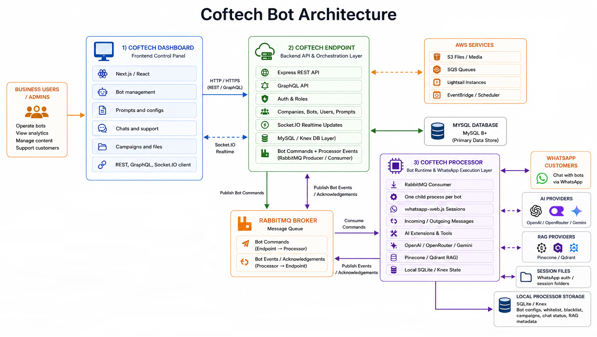

# Coftech Endpoint

Coftech Endpoint is the backend API and orchestration service for the Coftech Bot platform.

It provides REST and GraphQL APIs, authentication, bot management, company configuration, messaging persistence, integrations, webhooks, payments, storage, Socket.IO updates, background jobs, and RabbitMQ commands for bot processors.

## About Coftech Bot

Coftech Bot is a platform for businesses to create, configure, and manage AI-powered WhatsApp bots.

It helps companies automate customer conversations, answer questions, handle media and voice messages, run campaigns, connect integrations, and escalate chats to human support when needed.

The goal is to give businesses a central place to control their messaging bots while keeping the actual customer experience fast, useful, and personalized.

## Architecture



*Coftech Bot connects the dashboard, backend API, and WhatsApp processor into one automation platform.*


## What It Does

- Serves REST routes for platform resources such as accounts, bots, companies, prompts, campaigns, files, payments, storage, roles, and integrations.
- Serves GraphQL queries and mutations for dashboard data flows.
- Authenticates requests with JWT and applies role-based route permissions.
- Stores platform data in MySQL through Knex repositories and migrations.
- Emits real-time dashboard events through Socket.IO.
- Publishes bot lifecycle and messaging commands to RabbitMQ queues consumed by processors.
- Consumes and handles supporting background work such as SQS file manager tasks, cron jobs, webhook events, and scheduled reports.
- Integrates with AWS, OpenAI/OpenRouter, Gemini, Pinecone, payment providers, NocoDB, BotMaker, Yappy, NMI, and social network providers.

## Tech Stack

- Node.js
- Express
- Apollo Server / GraphQL
- Socket.IO
- Knex
- MySQL
- RabbitMQ
- AWS SDK / SQS
- OpenAI / OpenRouter
- Gemini
- Pinecone
- Swagger
- Joi

## Project Structure

```text
src/app.js                  Application entry point
src/routes/                 REST route definitions loaded by filename
src/controllers/            Request validation and HTTP response handlers
src/models/                 Business logic and orchestration services
src/repositories/           Database access helpers and query builders
src/graphql/                GraphQL schema, types, queries, mutations, and resolvers
src/utils/                  Shared integrations, middleware, sockets, queues, and helpers
src/db/migrations/          Knex database migrations
src/swagger/                Swagger/OpenAPI documentation modules
src/constants/              Shared constants and error codes
src/public/                 Static files served by Express
scripts/                    Maintenance and validation scripts
knexfile.js                 Database environment configuration
ecosystem.config.js         Process manager configuration
```

## Requirements

- Node.js v16 or higher
- npm or yarn
- MySQL v8.0 or higher
- RabbitMQ access
- AWS credentials for features that use S3, SQS, SNS, Lambda, EventBridge, Lightsail, Textract, Scheduler, or Secrets Manager
- Provider credentials for enabled integrations such as Discord, WhatsApp/social providers, payment providers, NocoDB, BotMaker, Yappy, or NMI

## Environment

Create a local `.env` file from `.env.example`:

```bash
cp .env.example .env
```

Core variables:

```env
ENVIRONMENT=development
PORT=3003
LOCAL_DB_HOSTNAME=localhost
LOCAL_DB_USERNAME=root
LOCAL_DB_PASSWORD=password
LOCAL_DB_DATABASE=endpoint
LOCAL_DB_PORT=3306
RABBITMQ_HOST=localhost:5672
RABBITMQ_VIRTUAL_HOST=/
```

Update the remaining variables in `.env` with local credentials, webhook URLs, provider tokens, queue URLs, bucket names, and infrastructure values as needed.

## Install

```bash
npm install
```

## Database

The endpoint uses MySQL through Knex, configured in `knexfile.js`.

Run migrations:

```bash
npm run migrate
```

The database stores platform state such as:

- accounts
- companies
- bots
- prompts
- configs and config templates
- social contacts and messages
- campaigns
- files and storage logs
- payments and orders
- roles and permissions
- extensions and plans
- dashboard logs
- agenda, call center, raffle, and integration data

## Run

Start the endpoint:

```bash
npm start
```

Start in development mode with install and migrations first:

```bash
npm run dev
```

Open:

```text
http://localhost:3003
```

Swagger is available in non-production environments at:

```text
http://localhost:3003/api-docs
```

GraphQL is available at:

```text
http://localhost:3003/graphql
```

When the service starts, it:

1. Loads environment variables.
2. Loads supported languages into cache.
3. Creates the Express HTTP server.
4. Initializes Socket.IO listeners.
5. Connects RabbitMQ.
6. Initializes cron jobs, SQS workers, and QR event handling.
7. Mounts Swagger, GraphQL, middleware, routes, and error handling.
8. Listens on `PORT`.

## Queue And Bot Events

The endpoint publishes processor commands such as:

- `initializeBOT`
- `cancelInitializationBOT`
- `startBot`
- `stopBot`
- `restartBot`
- `deleteBot`
- `sendMessage`
- `sendCampaignMessage`
- `set_bot_configs`
- `set_company_configs`
- `set_rag_configs`
- `setBotWhitelist`
- `setBotBlacklist`
- `get_chat_status`
- `update_chat_status`

The endpoint also receives and handles platform events from processors, including WhatsApp message events, bot lifecycle updates, QR/authentication states, support requests, generated completion usage, payment/calendar/tool actions, and error logs.

File manager background work is handled through AWS SQS, while processor orchestration uses RabbitMQ queues and instance-specific bot queues.

## API And Realtime Interfaces

The endpoint exposes REST routes through `src/routes/`, GraphQL through `/graphql`, and Swagger documentation in non-production environments through `/api-docs`.

Socket.IO is used for dashboard-facing real-time updates such as bot QR status, bot lifecycle state, chat assignment, message status, and support interaction events.

## Scripts

```bash
npm start       # Run the endpoint
npm run dev     # Install dependencies, run migrations, then start with nodemon
npm run migrate # Run latest migrations
npm run lint
npm test
```

## License

This repository is provided under an all-rights-reserved license.

See `LICENSE` for details.

## Note

The official Coftech backend servers are currently down. Hosted URLs, webhook endpoints, queues, buckets, and callback values in example configuration files are placeholders until Coftech-managed infrastructure is restored.
